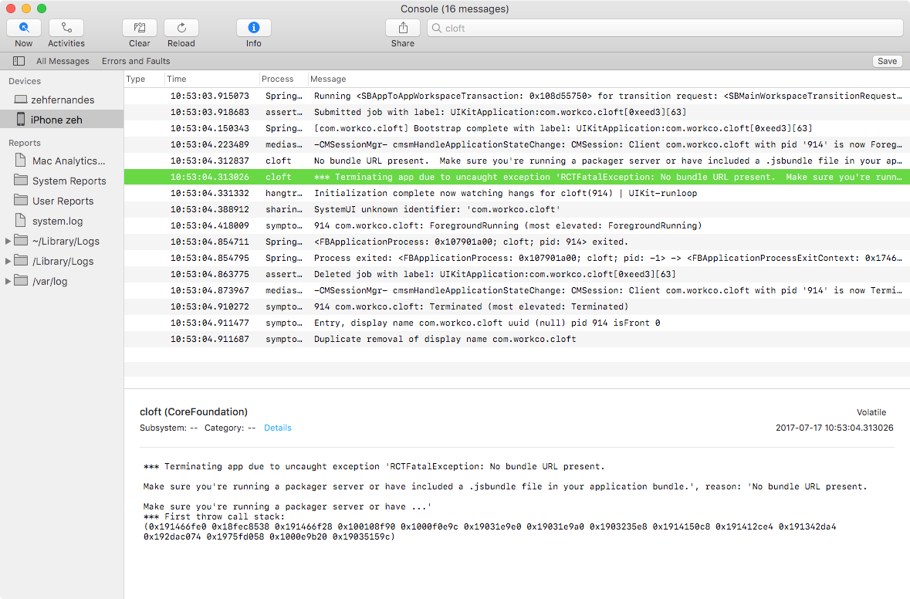

## Code: My notes after used react native to publish one-week app

Last week I had my first experience using React Native.
I compiled some of my discovery:

### Push the iOS app to Test Flight

Has a lot of guides explain how to publish a React
Native app. I try many of them and get sucked. The unique guide which really works is this one:

https://medium.com/react-native-training/fastlane-for-react-native-ios-android-app-devops-8ca85bee614e

But... This guide is excellent if you will create all certificate from scratch (from an empty account). In my case, the account reached the maximum number of available distribution certificate. So,

#### Reuse certificates

In the Code Signing step I followed this guide to help me:

http://macoscope.com/blog/simplify-your-life-with-fastlane-match/#migration

<br/><br/>

### Logs

#### See the log from installed app

That helps me debug why my app crash after I installed with Test Flight.
1. Use USB to connect your iPhone device
2. open the console.app
3. Search by your app name

<div>
	
</div>

#### Improve the readability of your react native log

The `react-native log-ios` output a lot of messages. So I log all my messages with a prefix `---LOG: ${message}`

and use `grep` to help me clean the log and watch just my messages:

```sh
react-native log ios | grep "---LOG:"
```

<br/><br/>


### Push the Android app

So much easy than apple 🙄

- I follow the Facebook guide
http://facebook.github.io/react-native/docs/signed-apk-android.html

- Used this post to help me protect my passwords
https://pilloxa.gitlab.io/posts/safer-passwords-in-gradle/

- And automate the process with fastlane:
https://medium.com/react-native-training/fastlane-for-react-native-ios-android-app-devops-8ca85bee614e

<br/><br/>

### Responsive measures

I use this little trick to guarantee my pixel measures will adapt to any device.

```js
import React from "react-native";
import Dimensions from 'Dimensions';

// Precalculate Device Dimensions for better performance
const x = Dimensions.get('window').width;
const y = Dimensions.get('window').height;

// Calculating ratio from iPhone breakpoints
const ratioX = x < 375 ? (x < 320 ? 0.75 : 0.875) : 1;
const ratioY = y < 568 ? (y < 480 ? 0.75 : 0.875) : 1;

// We set our base font size value
const base_unit = 16;

// We're simulating EM by changing font size according to Ratio
const unit = base_unit * ratioX;

// We add an em() shortcut function
function em(value) {
    return unit * value;
}

// Convert px values to em
function px(value) {
    let pxToEm = value / base_unit
    return em(pxToEm)
}

module.exports = {
    em,
    px
}
```
