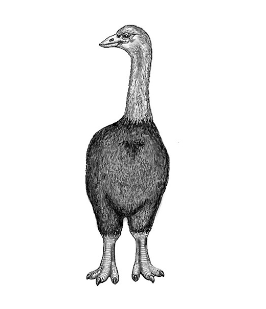
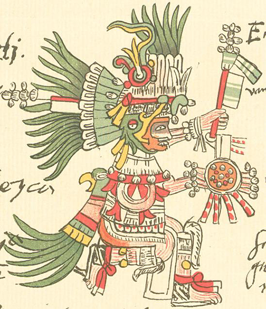

## Book: Sapiens - Uma Breve História da Humanidade
_Yuval Noah Harari_

### Conceitos

- Revolução Cognitiva deu início à história, há cerca de 70 mil anos. A Revolução Agrícola a acelerou, por volta de 12 mil anos atrás. A Revolução Científica, que começou há apenas 500 anos, pode muito bem colocar um fim à história e dar início a algo completamente diferente.

- Durante milhões de anos, os humanos caçaram criaturas menores e coletaram o que podiam, ao passo que eram caçados por predadores maiores. Somente há 400 mil anos que várias espécies de homem começaram a caçar animais grandes de maneira regular, e só nos últimos 100 mil anos – com a ascensão do Homo sapiens – esse homem saltou para o topo da cadeia alimentar.

- A maioria das doenças infecciosas que acometeram as sociedades agrícolas e industriais (como varíola, sarampo e tuberculose) se originou em animais domésticos e passou para os humanos somente após a Revolução Industrial.

- Nós não domesticamos o trigo; o trigo nos domesticou. Ninguém percebeu o que estava acontecendo. Cada geração continuou a viver como a geração anterior, Pensamos que estávamos economizando tempo; em vez disso, colocamos a roda da vida para girar a dez vezes sua velocidade anterior e tornamos nossos dias mais ansiosos e agitados. ★ 

####  `animismo`

- Deuses como a deusa da fertilidade, o deus do céu e o deus da medicina se tornaram protagonistas quando plantas e animais perderam sua capacidade de falar.
                
- Os animistas acreditavam que os humanos fossem apenas uma das muitas criaturas que habitam o mundo. Os politeístas, por outro lado, cada vez mais viam o mundo como um reflexo da relação entre deuses e humanos. ★ 

#### `sociedade moderna`

- Como o dinheiro teve êxito onde deuses e reis fracassaram?

- Acreditamos em uma ordem em particular não porque seja objetivamente verdadeira, mas porque acreditar nela nos permite cooperar de maneira eficaz e construir uma sociedade melhor.

- Garantir que cada indivíduo seja livre para fazer o que desejar inevitavelmente compromete a igualdade. Toda a história política do mundo desde 1789 pode ser vista como uma série de tentativas de superar essa contradição.

- Tomate, pimenta e cacau são de origem mexicana e chegaram à Europa e à Ásia apenas depois que os espanhóis conquistaram o México. Júlio César e Dante Alighieri nunca enrolaram espaguete coberto de molho de tomate com seus garfos

- A era moderna testemunhou a ascensão de uma série de religiões baseadas em leis naturais, como o liberalismo, o comunismo, o capitalismo, o nacionalismo e o nazismo.

- Nos primórdios da Europa moderna, considerava-se que os assassinos violavam e desestabilizavam a ordem cósmica. Para restaurar o equilíbrio cósmico, era necessário torturar e executar publicamente o criminoso, para que todos pudessem ver a ordem restabelecida.

- Na Europa de hoje, o assassinato é visto como uma violação da natureza sagrada da humanidade. Para restaurar a ordem, os europeus de hoje não torturam e executam criminosos. Em vez disso, punem um assassino da forma que consideram a mais “humana” possível, de modo a proteger e até mesmo reconstruir sua santidade humana. ★ 

#### `consumo`

- A elite do Egito antigo gastou sua fortuna construindo pirâmides e mumificando seus cadáveres, mas quase ninguém pensou em ir fazer compras na Babilônia ou ir esquiar na Fenícia.

- O romantismo, que encoraja a variedade, casa perfeitamente com o consumismo. Esse casamento deu à luz o infinito “mercado de experiências” sobre o qual se ergueu a indústria de turismo moderna. ★ 

-  A afirmação de Smith de que o desejo humano egoísta de aumentar o lucro privado é a base para a riqueza coletiva é uma das ideias mais revolucionárias na história humana

- Comércio de escravos não era controlado por nenhum Estado ou governo. Foi uma iniciativa puramente econômica,

#### `escrita`

- Inventar tais métodos se mostrou muito mais difícil do que inventar a escrita. Muitos sistemas de escrita se desenvolveram de maneira independente em culturas distantes umas das outras no tempo e no espaço.   

- O que distingue a Suméria, bem como o Egito faraônico, a China antiga e o Império Inca, é que essas culturas desenvolveram boas técnicas de arquivamento, catalogação e consulta de registros escritos. Elas também investiram em escolas para escribas, escriturários, bibliotecários e contadores. ★ 

- Os especialistas fazem o que podem para traduzir até mesmo ideias como “pobreza”, “felicidade” e “honestidade” em números (“a linha de pobreza”, “níveis de bem-estar subjetivos”, “índice de credibilidade”). Campos inteiros do conhecimento, como a física e a engenharia, já perderam quase todo o contato com a linguagem humana falada e são mantidos unicamente por notação matemática.

### Quotes

- "A tolerância não é uma marca registrada dos sapiens. [...] nossos ancestrais eliminaram os neandertais. Eles eram similares demais para se ignorar, mas diferentes demais para se tolerar." ★ 

- "Nossa linguagem evoluiu como uma forma de fofoca."

- "Tudo se resumia a contar histórias e convencer as pessoas a acreditarem nelas."

- "Se nossa mente é a dos caçadores-coletores, nossa culinária é a dos antigos agricultores."

- "Há apenas um processo evolutivo cego e destituído de propósito"

- "O cristão típico acredita no Deus monoteísta, mas também no Diabo dualista, em santos politeístas e em fantasmas animistas."

- "O ser humano hoje, está prestes a se tornar um deus, pronto para adquirir não só a juventude eterna como também as capacidades divinas de criação e destruição. [...] Existe algo mais perigoso do que deuses insatisfeitos e irresponsáveis que não sabem o que querem?"

- "História da armadilha do luxo"

### Noção histórica

- Estatueta em marfim de um “homem-leão” (ou “mulher-leoa”) da caverna de Stadel, na Alemanha (c. 32 mil anos atrás). O corpo é humano, mas a cabeça é leonina. Este é um dos primeiros exemplos indiscutíveis de arte, e provavelmente de religião e da capacidade da mente humana de imaginar coisas que não existem de fato.

- Os maoris, os primeiros colonizadores sapiens da Nova Zelândia, chegaram às ilhas há cerca de 800 anos. Em poucos séculos, a maior parte da megafauna local foi extinta, junto com 60% de todas as espécies de pássaros.

- O registro histórico faz o Homo sapiens parecer um assassino em série da ecologia [...] Homo sapiens levou à extinção cerca de metade dos grandes animais do planeta muito antes de os humanos inventarem a roda, a escrita ou ferramentas de ferro.

- A transição para a agricultura começou por volta de 9500-8500 a.C. no interior montanhoso do sudeste da Turquia, no oeste do Irã e no Levante.

- O primeiro nome registrado na história pertença a um contador, e não a um profeta, poeta ou grande conquistador. ★ 

- A vitória de Roma sobre a Numância foi tão completa que os vitoriosos se apropriaram até da memória dos derrotados.

- Na manhã após a batalha de Waterloo (1815), viam-se montes de mãos e pernas amputados ao lado dos hospitais nos campos de batalha. Naqueles dias, carpinteiros e açougueiros que se alistavam no exército muitas vezes eram enviados para servir no batalhão médico, porque a cirurgia requeria pouco mais do que saber usar serras e facas.

- Durante os séculos XV e XVI, os europeus começaram a desenhar mapas-múndi com vários espaços vazios

- O primeiro homem moderno foi Américo Vespúcio,

### Palavras

- `Epítome`: Resumo de uma obra direcionada para o uso didático.
- `Animismo`: Visão de mundo em que entidades não-humanas possuem uma essência espiritual
- `Cola mítica`      
- `Códigos sociopolíticos`
- [`Luddista`](https://pt.wikipedia.org/wiki/Ludismo): oposição à industrialização intensa ou a novas tecnologias
- [`Oxímoros`](https://pt.wikipedia.org/wiki/Ox%C3%ADmoro) figura de linguagem com conceitos contrários
- `Didssonância cognitiva`
- `Amortais` 
- `Eurásia`: Europa + Ásia
           

	
	
	 Pássaro-elefante & Huitzilopochtli (Deus asteca)

           