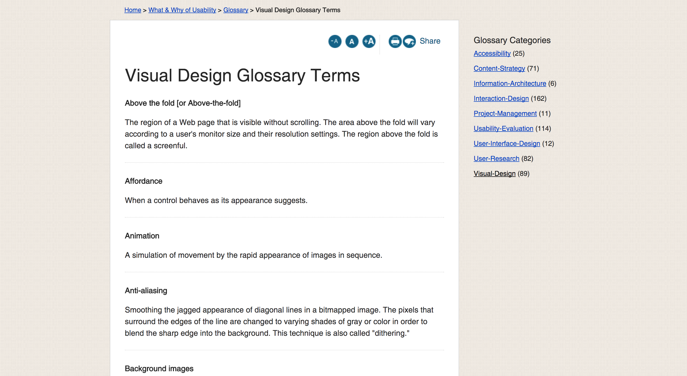
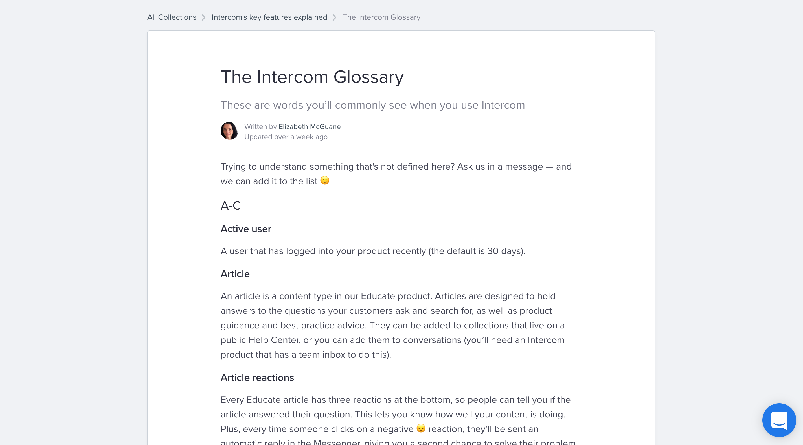
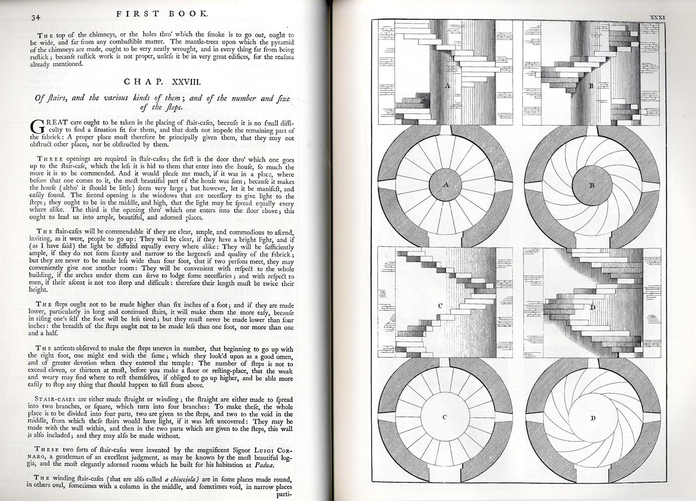

## Book: Design system
_Alla Kholmatova_

### Concepts

#### `the purpose`

- A pattern library reflects the design system behind it. If your system is fundamentally rigid and restricting, the pattern library can reveal and emphasize the rigidity. If it allows plenty of creative experiments, a good pattern library can make experimentation easier.
- The team should recognize that purpose and believe in it.

#### `tips`

- Interface inventories should be done regularity
- Design system catch-ups is a good opportunity to share new modules and discuss their purpose
- Create a pattern wall to make the process open and transparent to the rest of the company and encourage more people to join in
- Keep glossary ★

	
	

#### `behaviors`

- Behaviors are plataform neutral ( Key behaviors )
- Behaviors should be meningful and work from the user's perspective, as well as the bussiness's. "Promotion" of the books benefits only the library, but "Discovering" new books also has value for the reader.

#### `abstract thinking`

- Mode view to design system: You will be constantly shifiting from the system as a whole to individual patterns
- In the vast majority of today's pattern libraries, styles are displayed on separate pages. I see this as a limitation. Perhaps the next generation of pattern libraries can show them in more connected ways?'

### Quotes

- "Design is shaped by the choices we make"
- "Designes become frustrated always solving the same problem"
- "The words we choose matter. They influence how we think."
- "Deciding the level of specificity is one of the trickiest thing about modular design"

### Historical notion

- Earliest examples of system documentation: Palladio's The Four Books of Architecture, 1970 Venice.

	
	

### Links

- https://www.slideshare.net/futureinsights/sowhat-do-i-make-dan-mall
- http://microinteractions.com/
- https://nordnet.design/an-atomic-workflow-for-design-development-at-nordnet-e91c815428b6
- http://www.webaxe.org/proper-use-buttons-links/
