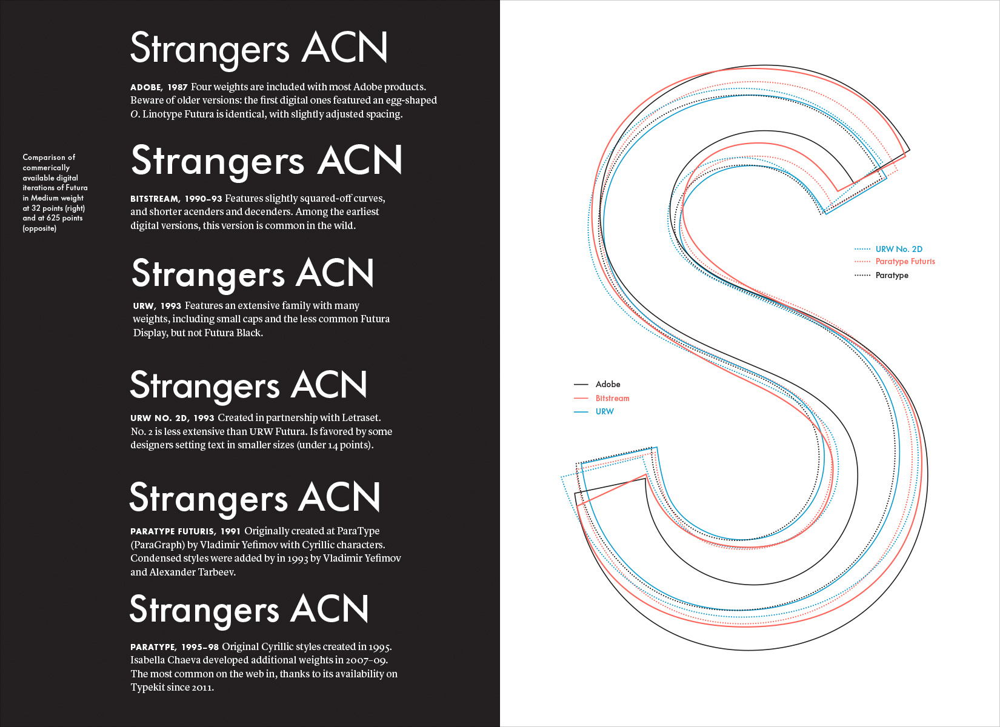

## Book: Architectural Intelligece
_Molly Wright Steenson_

### Notes

    

- "Models serve as the messure of an idea"
- "Contractors will have to face automation in construction jsut as the architects will ahve to face automation of design" - Minsky Marvin, 1974
- About Sketchpad, 1964 The entire process is one of continuos communication between the designer and the machine, but one in witch the designer is always in complete control. He is free to accept the implications of what he has done, as shown him by the computer, or to modify his original concpet based on the implications.

- "Heuristics" means "serving to discover" and whas popularized by Geroge Pólya's 1945 book How to solve It. Is about how people structured theyr own problem solving.

- Gestlat psychology, a branch of psychology that studies the relationship of the parts to the whole

- "symbolized concepts" | Engelbart
- "demands of the form is context"

- "The designer sense of organization"

#### `Christopher Alexander`

- Alexander is often umpopular with architects, they dislike his moralistic tone and disagree with him that there is an objetive notion of goodness to be found in architecture. [...] Architects ten not to see architeture as a thrth to bem proven.
- 1964 already use a computer to Calculate and graph the relationships between requeriments of a design problem
- design problem as an information problem.
- The ability to bring a system back to equilibrium is _ultrastability_
- "Most designers were intrinsically biased, likely to have the solution in mind before they began"
- He try to designing for networks at the scale of cities. Applying social network analysis to architectural and urban deisgn, it is remarkable.
- Alexander oted for "tendencies" as "needs". because people do not always know what their needs.
- ★ I ... want to state, publicly that I reject the whole idea of design methods. [...] I think it is absurd to separate the study of desiging from the practice of design"
- "a finite system of rules witch a person can use to generate an inifite variety of buildings"

- People argue that his ideas work in the abstract but not in practice: An argument that is Alexander continues over the years experimented with trees, smilattices, and patern networks, only to discover that he didn't like the geometry and the architeture that resulted.

- "As they design interfaces that control more and more of the wolrd, there are potentially outsize consequences for the design and programming decisions they make"

#### `Richard Saul Wurman`

- Creator of TED
- In short in the desire to win, we had lost. (what if, could-be)
- "to making information inform - finding the form in information"
- typologise information
- Information architeture is the form of rethoric.
- Humans have shaped computers more than they have shaped us.
- TED is a middleborw megachurve infortaiment... a combination of epiphany and personal testimony (an 'epiphimony' if you like) 
- If you want to be relevant, you need to be open to an enormous multiplicty of values, interpretation, and readings. The old-fashioned Western 'this is' 'that is' is no longer tenable. [...] You can only understand something relative to something you understand.

----

- The concept of user-friendliness wasn't even coined till 1972, and it took till the early 1980ss for it to become a common part of your vocabulary.
- Design is an act of exploration; it is feedback-oriented, it requires a willingness to change, and it requieres a senstivity to the aestehtics of the final product.
Andrew Cohill design principle number 3
- A broder definition of experience and experience  design, one that put humans and not users at the center. Garret in 2016

#### `Cedric Price`

- It wasn't about the bulding (software) themselves, it was about the interactions (behaivor) that they could shape.
- For cetric archieteture was a Infinte Games played not to determine a winner or a loser, but rather "for the purposes of continuing the play"

### Historical Notion

- Design Methods movement.

Software Manifesto Mitch Kapor 1990
- Kapor suggest that a "theory of design for software" could aply the Vitruvian concerts as "Firmness: A programan should not have anu bugs that inhibit its funciton. Commodity: A program should be suitable for the purposes for which it was intend. Delight: The experience of using the program should be a plesurable one."
- Software design was a way to develop a common language that could mediate between users, business, and programmers

Bring design to software
- "Design languages could be used for translating complex actions into simpler steps, [...] help someone master an unfamiliar task."

- By 2008, the lines interseect, and after 2009, interest in user experience overtakes that of information architeture.
- In 2005 Tim O'Reilly coined the term "Web 2.0"
- Jesse James Garret and his colleagues at Adaptive Path coined the term "AJAX"
- Social meida explored with FAcebook, which launched on campuses in 2004, and, by 2007 was in heavy use by adults and teens.
- Twitter launched in 2006 and started becoming massively popular in 2007.
- Apple lauched the iPhone in 2007 and Google Android in 2008.

### Quotes

- Plato in Phaedrus (Fedro), "I am myself a great lover of these process of divison and generalization; tehy help me to speak and to think. and if I find any man who is able to see 'a One and Many' in nature, him I follow, and 'walk in his footsteps as if he were a god'"

- "patterns is the most disastrous thing about programing" because "trying to do that in computing is the assumption that we know anything at all about programming. So extracting patterns from today's programming practices ennobles them in a way they don't deserve." - Alan Kay

- "Form, 'a harmony of systems,' generates design." - Louis Kahn

### People

- [`Mitch Kapor`](https://en.wikipedia.org/wiki/Mitch_Kapor): Designer of the Lotus 1-2-3 (spreedsheet programan)
- [`Jean Nicolas Louis Durand`](https://www.researchgate.net/figure/Jean-Nicolas-Louis-Durand-Precis-des-lecons-darchitecture-Table-20-10_fig1_323607100): One of the first to show Architetural Typology
- [`Louis Kahn`]()
- [`Ithiel de Sola Pool`](https://en.wikipedia.org/wiki/Ithiel_de_Sola_Pool): coined the term convergence

- https://en.wikipedia.org/wiki/Archigram

### Refs

- The Design of Design
- Make it New: The History of Silicon Valley Design | Barry Katz's
- Builders of the Vision: Software and the Imagination of Design
- Cities: Comparation of Form and Scale

